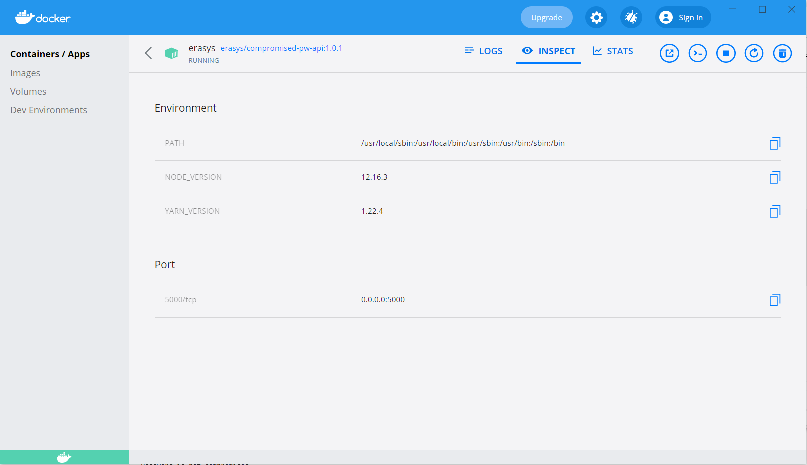

I thoroughly enjoyed working on this trial task. I am glad to inform you that I have completed the task and the bonus task also. Please have a look and let me know if any demonstration or showcase is needed.

# Password Check Application
Erasys Backend Trial Task: Password Check Application
To know more about the task <a href="https://github.com/erasys/backend-trial-task">click here</a>


# Solution

## Prerequisite
1. Node JS should be installed in the system
2. <a href="https://hub.docker.com/r/erasys/compromised-pw-api">Docker Image</a> should be running in http://localhost:5000 

3. Set database connection in `run.js`
4. Set rules in `configuration.json` file.

## Set Database Connection
Update database connection details in `run.js`. 

```
var dbCon = mysql.createConnection({
  host: "localhost", // host
  user: "root", // username
  password: "", // password
  database: "testdb", // database name
});
```
Note: To find database dump <a href="https://github.com/erasys/backend-trial-task/blob/master/sqldump.sql">click here</a>. 

## Set rules in configuration.json file
The password validation ruleset are as follows:

- Password length is minimum 5 characters
- At least one digit is used in the password
- There are no more than two repeating characters (like 'bbb' – 2 are allowed, but not 3 or more)
- There is at least one upper-case character OR alternatively one special character

Allowed special characters are,
```
~ @ # $ % ^ & * + = ` | ' { } < > : ; ! . , ? \ " _ / [ ] ( ) - 
```

## Project Set Up
1. Download or clone the project repository (https://github.com/amburi/Password-Check-Application)
2. Then go to project folder and run `npm install` from terminal. Required dependencies will be installed.

## Project Execute/Run
1. Now run `node endpoint.js` in termial. It will run the server endpoint api in http://localhost:3000. Keep this running.

```
> node endpoint.js
Server is running at http://127.0.0.1:3000
```
2. Open new terminal and run `node run.js`. It should run the script to validate passwords in database based on password check rules mentioned in `configuration.json` and also check if password is compromised or not.

Sample Output:

```
------- 
Password: AKp$
Error Message(s):
Password length must be minimum 5 characters
Password should have atleast one digit
Password is compromised
-------
Password: amhhy
Error Message(s):
Password should have atleast one digit
Password should have at least one upper-case character or alternatively one special character
Password is not compromised
------- 
Password: a1g!7
Password is valid
Password is not compromised
```
<a href="output/log.txt">Click here</a> to check entire output.

The sript is setting the `valid` field in database `passwords` table to 1 or 0 for valid and invalid passwords respectively. 


Thank You!