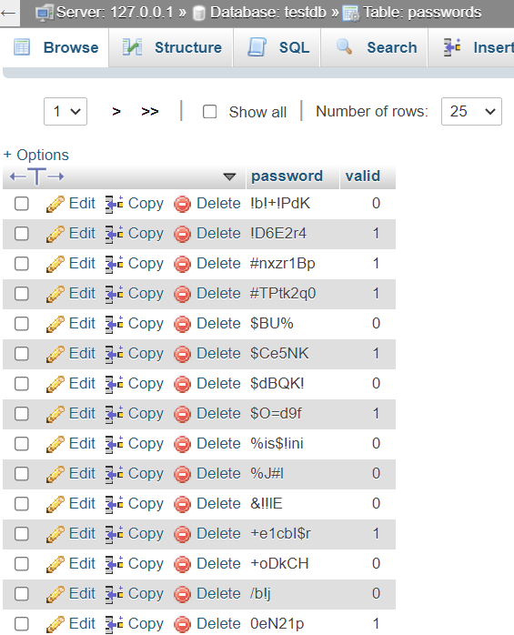

# Password Check Application

## Table of Contents

- [Introduction](#introduction)
- [Business Requirements](#business-requirements)
- [Functional Requirements](#functional-requirements)
- [Prerequisites](#prerequisites)
- [Setup Instructions](#setup-instructions)
  - [Database Connection](#database-connection)
  - [Configuration Rules](#configuration-rules)
- [Running the Application](#running-the-application)
  - [Starting the API Server](#starting-the-api-server)
  - [Executing the Validation Script](#executing-the-validation-script)
- [Sample Output](#sample-output)
- [Notes](#notes)
- [Conclusion](#conclusion)

## Introduction

The Password Check Application is designed to enhance security by ensuring users set strong passwords. This is achieved by validating passwords against a set of configurable rules and checking if they have been compromised. The project includes a REST API for real-time password validation and a script for batch-validating existing passwords stored in a database.

## Business Requirements

To prevent unauthorized access due to weak passwords, the system must:
1. Validate passwords against predefined rules.
2. Check if passwords have been previously compromised.
3. Update password validity status in the database.

## Functional Requirements

1. **Password Validation API**
   - Endpoint to validate passwords against a set of rules.
   - Responds with `204 No Content` if the password is valid.
   - Responds with `400 Bad Request` and error messages if the password is invalid.
   - Validation rules are defined in a separate configuration file.

2. **Batch Validation Script**
   - Reads passwords from a MySQL database.
   - Uses the Password Validation API to validate each password.
   - Checks each password against a compromised password API.
   - Updates the `valid` field in the database based on the validation results.

## Prerequisites

1. Node.js installed on the system.
2. Docker running the compromised passwords API image (`amburi/compromised-passwords`) at `http://localhost:8080`. Refer: [docker-image](https://hub.docker.com/repository/docker/amburi/compromised-passwords)
3. MySQL database with connection details configured in the script.

## Setup Instructions

### Database Connection

Update the database connection details in `index.js`:

```javascript
var dbCon = mysql.createConnection({
  host: "localhost", // host
  user: "root", // username
  password: "", // password
  database: "passwordDb", // database name
});
```

### Configuration Rules

Define password validation rules in `configuration.json`:

```json
[
    {
        "rex": "^(?=.{5,}).*$",
        "error": "Password length must be minimum 5 characters"
    },
    {
        "rex": "\\d",
        "error": "Password should have atleast one digit"
    },
    {
        "rex": "^(?!.*(.)\\1{2}).*$",
        "error": "Password should not have more than two repeating characters"
    },
    {
        "rex": "^((?=.*[A-Z])|(?=.*[~@#$%^&*+=`|'{}<>:;!.,?\"_\\\/\\[\\]()-]+)).*$",
        "error": "Password should have at least one upper-case character or alternatively one special character"
    }
]
```

## Running the Application

### Starting the API Server

1. Navigate to the project folder.
2. Install required dependencies:

```bash
npm install
```

3. Start the API server:

```bash
node endpoint.js
```

The server will run at [http://localhost:3000](http://localhost:3000).

### Executing the Validation Script

1. Open a new terminal.
2. Run the validation script:

```bash
node index.js
```

This script will validate passwords based on the rules specified in [configuration.json](./configuration.json) and check for compromised passwords.

## Sample Output

Example output from the validation script:

```
------- 
Password: AKp$
Error Message(s):
Password length must be minimum 5 characters and include at least one digit.
Password is compromised.
-------
Password: amhhy
Error Message(s):
Password should have at least one digit.
Password should have at least one upper-case character or one special character.
Password is not compromised.
------- 
Password: a1g!7
Password is valid.
Password is not compromised.
```

The script updates the `valid` field in the `passwords` table to `1` for valid passwords and `0` for invalid passwords.



## Notes

- Ensure the Docker container for the compromised passwords API is running at [http://localhost:8080](http://localhost:8080).
- Modify the database connection details as necessary.

## Conclusion

This Password Check Application ensures enhanced security by validating passwords against configurable rules and checking for compromised passwords. By integrating this application, we can significantly reduce the risk of unauthorized access due to weak passwords.